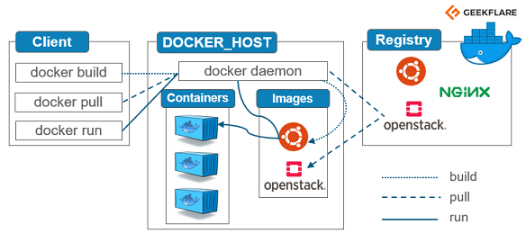
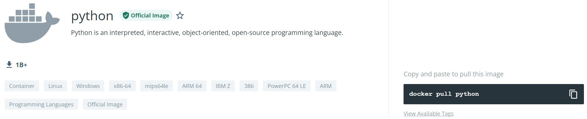
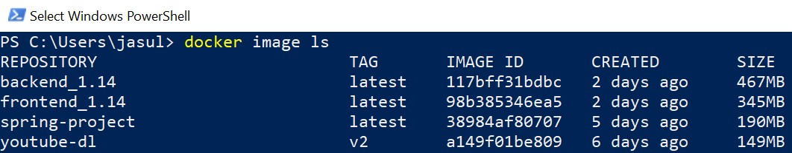
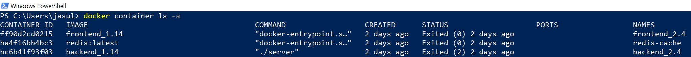

# learn-docker
**Docker tutorial** by Hee Chun Lee
## Introduction
### What is Docker? 
> Platform that delivers OS-level virtualization to deliver software. 

### Structure

1. **Client** - Bash or terminal that accepts docker commands. 
2. **Docker Host** - Local docker platform that contains Images and Containers. 
3. **Registry** - Github-like repository for sharing Images <br />(Docker Hub is most commonly used registry). 

## Commands for Basic Usage 
(1) **pull** - Pulls docker image from docker registry without running Image.  
```bash
docker pull IMAGE
```
Pull commands and tags for different versions of the same Image can be found on [docker hub](https://hub.docker.com/_/python). 


(2) **run** - Runs and creates instance (ie. Container) of docker Image. 

If Image cannot be located in docker host, it will be searched for and pulled from docker registry. 

Different options can be used to modify the operation of the ```run``` command. 
```bash 
docker run IMAGE  

# Runs IMAGE in detached mode in background.
docker run -d IMAGE 

# Runs IMAGE to create Container with name CONTAINER_NAME. 
# If not specified, random CONTAINER_NAME will be assigned
docker run --name CONTAINER_NAME IMAGE 

# Runs IMAGE in interactive terminal mode but non-usable if running Image does not default to bash (check Dockerfile CMD and ENTRYPOINT). 
docker run -it IMAGE 

# Runs IMAGE and sets environment variable ENV_VAR to argument env_var. 
docker run -e ENV_VAR=env_var IMAGE
```
### Two Important Functions of ```run```: 
>**Volumes**

&nbsp;&nbsp;&nbsp; Flexible method of storing data on local system from docker host. 

&nbsp;&nbsp;&nbsp; Files are not tied to Container, therefore removing Container does not remove files. 
```bash 
# Runs IMAGE and maps output volume from CONTAINER_DIR in docker host to LOCAL_DIR in local system. 
# CONTAINER_DIR can be identified from WORK_DIR in Dockerfile. 
docker run -v LOCAL_DIR:CONTAINER_DIR IMAGE
```

>**Port Mapping**

&nbsp;&nbsp;&nbsp; Maps port of local docker host to port of docker Container on external host. 

&nbsp;&nbsp;&nbsp; Allows running of applications from external IP address and multiple instances of application on one docker host. 
```bash
# Runs IMAGE and maps output from EXPOSED_PORT to MAPPED_PORT. 
# Accesible by navigating to 'http://localhost:MAPPED_PORT' in browser. 
docker run -p MAPPED_PORT:EXPOSED_PORT IMAGE 
```

(3) **exec** - Executes a command for a running Container. 
```bash
docker exec CONTAINER COMMAND
```

(4) **start**/**stop** - Starts or stops a Container.  
```bash 
docker start CONTAINER 
docker stop CONTAINER 
```

(5) **Build** - Builds custom Image based off of existing Dockerfile. 
```bash
# Builds Image based off Dockerfile located in PATH directory. 
# If not specified by -f option, docker will automatically search for DOCKERFILE called 'Dockerfile'. 
docker build PATH  

# Builds Image based off Dockerfile existing in current directory named DOCKERFILE. 
docker build . -f DOCKERFILE

# Builds Image called IMAGE_NAME based off Dockerfile existing in current directory. 
docker build . -t IMAGE_NAME
```

## Commands for Navigating Docker Host 
(1) **ls** - Displays current Images and Containers. 
```bash
# Both commands will display Images. 
docker image ls 
docker images 
```

```bash
# Displays currently running Containers. 
docker container ls 

# Displays all existing containers: running or stopped. 
docker container ls -a 
```


(2) **rm** - Removes a Container. 

In order for Container to be removed, it must be stopped first. 
```bash
# Container can be removed either by NAMES or CONTAINER_ID. 
docker rm NAMES 
# Accepts regex expression of CONTAINER_ID. 
docker rm CONTAINER_ID
```

(3) **rmi** - Removes an Image. 

In order for Image to be removed, there must be no existing Container instances of the Image. 
```bash
docker rmi IMAGE

# Force removes IMAGE and all Containers of IMAGE (used in case there are existing Containers of IMAGE). 
docker rmi -f IMAGE
```

